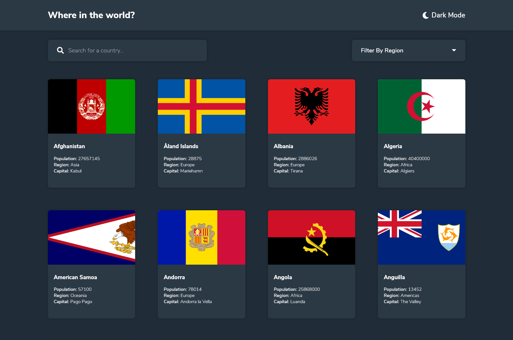

# REST Countries API with color theme switcher solution

A single-page application that displays information about all the countries of the world by integrating with a REST API.

## Table of contents

- [Overview](#overview)
  - [The challenge](#the-challenge)
  - [Screenshot](#screenshot)
- [My process](#my-process)
  - [Built with](#built-with)
  - [Useful resources](#useful-resources)
- [Author](#author)

## Overview

### The challenge

Users should be able to:

- See all countries from the API on the homepage
- Search for a country using an `input` field
- Filter countries by region
- Click on a country to see more detailed information on a separate page
- Click through to the border countries on the detail page
- Toggle the color scheme between light and dark mode _(optional)_

### Screenshot

## My process

### Built with

- Semantic HTML5 markup
- CSS custom properties
- Flexbox
- CSS Grid
- JavaScript

### Useful resources

- [Stack Overflow](https://www.stackoverflow.com) - As always, when I got stuck, stackoverflow helped me get through.
- [w3Schools](https://www.w3schools.com) - In my opinion, this is the best website for documentation with easily understandable code examples.

## Author

- Sahil Dipak Joshi
- Github - [@SahilDipakJoshi](https://github.com/sahiljoshi23?tab=repositories)
- Linkedin - [@SahilDipakJoshi](https://www.linkedin.com/in/sahil-joshi-bb23a52a6/)
